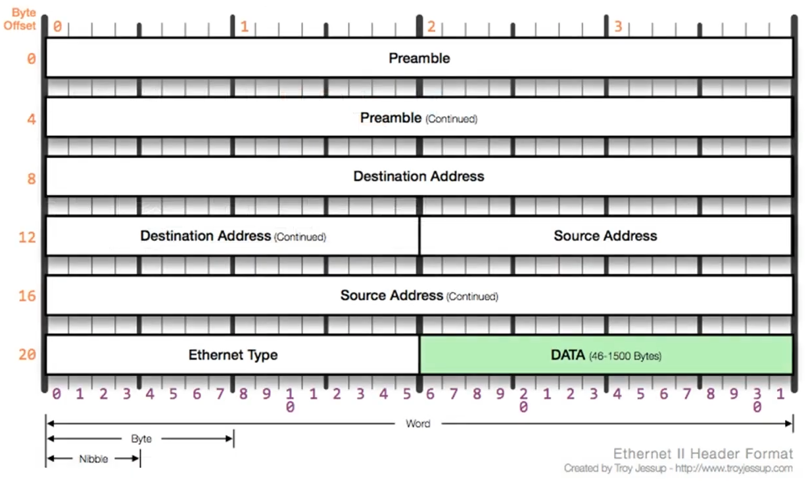

### [2계층에서 하는일](https://youtu.be/HkiOygWMARs?list=PL0d8NnikouEWcF1jJueLdjRIC4HsUlULi)

#### 2계층(데이터 링크 계층)의 역할

- 가까운 네트워크(LAN) 통신: 같은 네트워크 대역 내에서의 데이터 송수신 담당
- 흐름 제어: 누가 누구에게 데이터를 보낼지 결정
- 오류 제어: 데이터에 오류가 있는지 검사
- 제한: 같은 네트워크 대역에서만 사용 가능, 다른 대역과 통신 시 3계층의 지원 필요

#### MAC 주소

- 물리적 주소: 네트워크 장비마다 고유하게 부여된 주소, 16진수로 표현
- 형식: 앞부분(6바이트)은 제조사 식별 번호(OUI), 뒷부분은 고유한 장치 식별 번호
- 특징: IP 주소와 달리 하드웨어에 고유하게 부여되어 쉽게 변경 불가

---

### [2계층(Ethernet) 프로토콜](https://youtu.be/HkiOygWMARs?list=PL0d8NnikouEWcF1jJueLdjRIC4HsUlULi)

#### 이더넷 프로토콜의 구조



- 구성 요소:
  - 목적지 MAC 주소(6바이트): 데이터를 받을 장비의 MAC 주소
  - 출발지 MAC 주소(6바이트): 데이터를 보내는 장비의 MAC 주소
  - 이더넷 타입(2바이트): 상위 프로토콜이 무엇인지 알려주는 정보 (예: IPv4 - 0x0800, ARP - 0x0806)
- 총 크기: 14바이트 헤더로 구성

#### 실습 및 MAC 주소 확인

- MAC 주소 확인: ipconfig /all 명령어로 MAC 주소 확인 가능

  ```
  이더넷 어댑터 이더넷:

   연결별 DNS 접미사. . . . :
   설명. . . . . . . . . . . . : Realtek USB GbE Family Controller
   물리적 주소 . . . . . . . . : MM-MM-MM-SS-SS-SS
   DHCP 사용 . . . . . . . . . : 예
   자동 구성 사용. . . . . . . : 예
   ...
  ```

  - M (Manufacture ID): 앞부분의 6자리 / OUI라 불리며, 제조사 식별을 위한 값. 동일한 회사가 만든 장치들은 동일한 OUI를 가짐
  - S (Serial ID): 뒷부분의 6자리 / 장치 고유 번호. 제조사가 만든 각 장치에 부여된 고유 번호

- 와이어샤크 사용: 패킷 캡처를 통해 목적지 MAC 주소, 출발지 MAC 주소, 이더넷 타입 등을 확인하여 구조 파악
  ```
  Frame 7: 74 bytes on wire (592 bits), 74 bytes captured (592 bits) on interface \Device\NPF_{ID}, id 0
  Ethernet II, Src: SamsungE_SS:SS:SS (MM:MM:MM:SS:SS:SS), Dst: SamsungE_SS:SS:SS (MM:MM:MM:SS:SS:SS)
  Internet Protocol Version 4, Src: 192.168.xx.xx, Dst: 192.168.xx.xx
  Internet Control Message Protocol
  ```
- 상위 프로토콜 구분: IP 버전 4와 ARP를 구분하기 위해 이더넷 타입 필드 사용

#### 이더넷 프로토콜 캡슐화와 상위 프로토콜 연결

- 캡슐화: 상위 계층의 프로토콜 정보를 포함하여 데이터를 전달
- 이더넷 타입 활용: 패킷을 처리할 때 상위 프로토콜이 무엇인지 미리 알려줌으로써 데이터 처리 효율 향상
