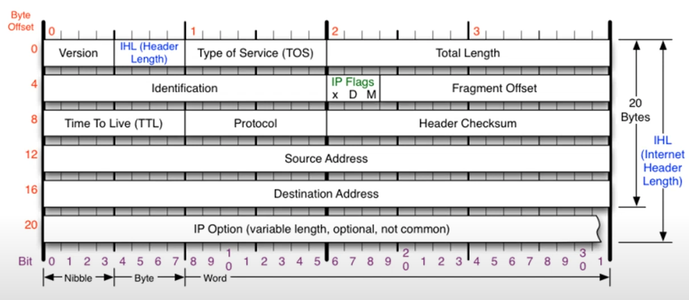

### [3계층의 기능](https://youtu.be/s5kIGnaNFvM?list=PL0d8NnikouEWcF1jJueLdjRIC4HsUlULi)

#### 1. IP 주소와 맥 주소

- IP 주소: 네트워크 상에서 특정 장치를 식별하는 주소체계로 주로 사용자가 인식하며, 멀리 떨어진 장치 간 통신에 사용됨
- 맥 주소(MAC): 장치 간 근거리 통신에 사용되는 물리적 주소체계로, 사용자가 직접 입력하기 어렵기 때문에 일반적으로 사용되지 않음

#### 2. IP 주소의 계층 및 3계층의 역할

- 3계층의 역할: 서로 다른 네트워크 대역(LAN)을 연결해주는 역할을 담당하며, 이를 위해 라우터와 같은 3계층 장비가 필요
- IP 주소 구성: IP 주소는 3계층에서 사용되며, 명령어 ipconfig로 확인 가능함

---

### [일반적인 IP 주소](https://youtu.be/s5kIGnaNFvM?list=PL0d8NnikouEWcF1jJueLdjRIC4HsUlULi)

#### 1. IP 주소의 클래스(Class)와 서브넷 마스크

```
이더넷 어댑터 이더넷:
  링크-로컬 IPv6 주소 . . . . : xxxx::xxxx:xxxx:xxxx:xxxx%xx
  IPv4 주소 . . . . . . . . . : xxx.xxx.xxx.xxx
  서브넷 마스크 . . . . . . . : xxx.xxx.xxx.xxx
  기본 게이트웨이 . . . . . . : xxx.xxx.xxx.xxx
```



- 구성
  - IPv4 주소 : 현재 PC에 할당된 IP주소<br>
    (10진수 : 0.0.0.0 - 255.255.255.255 / 2진수 : 00000000.00000000.00000000.00000000 - 11111111.11111111.11111111.11111111)
  - 서브넷 마스크 : IP 주소에 대한 네트워크의 대역을 규정하는 것
  - 게이트웨이 주소 : 외부와 통신할 때 사용하는 네트워크의 출입구
- IP 주소 클래스 (IPv4 기준):
  - A 클래스: **첫번째 필드만 네트워크 대역 구분, 나머지는 각자 고유번호** / 시작번호 : 0. 0.0.0
  - B 클래스: **두번째 필드까지 네트워크 대역 구분, 나머지는 각자 고유번호** / 시작번호 : 128.0. 0.0
  - C 클래스: **세번째 필드까지 네트워크 대역 구분, 나머지는 각자 고유번호** / 시작번호 : 192.0.0. 0
  - D 클래스: 멀티캐스트 용도 / 시작번호 : 224.0.0.0
  - E 클래스: 실험용 IP 주소 대역 / 시작번호 : 240.0.0.0
- 서브넷 마스크: 네트워크 대역의 범위를 더 세분화하여 필요한 IP 주소 개수에 맞추어 관리 가능 (예: 255.255.255.0은 C 클래스 기본 서브넷)

#### 2. 사설 IP와 공인 IP의 개념

- 사설 IP: 동일 네트워크 내에서 사용하는 IP 주소로 외부 인터넷과 직접 연결되지 않음
- 공인 IP: 외부 인터넷과의 통신에 사용되는 IP 주소로, 인터넷 서비스 제공자(ISP)가 관리하며 통신 시 공유기가 사설 IP와 공인 IP 간 주소 변환을 수행 (NAT: Network Address Translation)

#### 3. IP 주소 클래스의 한계와 서브넷팅

- 서브넷팅: 네트워크 자원을 효율적으로 사용하기 위해 IP 대역을 작은 네트워크 단위로 나누는 방식
- 서브넷 마스크의 적용 예시: 기존 A, B, C 클래스 구분을 따르지 않고, 사용자 필요에 따라 자유롭게 네트워크를 나눌 수 있게 해줌

#### 4. IP 주소의 고갈 문제와 해결방안

- IP 고갈 문제: 장비와 사용자 증가로 인해 IPv4 주소 부족 현상이 발생
- 해결방안: IPv6 도입 (128비트 주소체계, 더 많은 주소 제공), 공인 및 사설 IP 구분, NAT 사용
- IPv6의 도입 및 전환: IPv4보다 더 많은 주소 공간을 제공하고 있지만 기존 장비의 호환성 문제로 IPv4와 IPv6가 병행 사용되는 중

---

### [특수한 IP 주소](https://youtu.be/s5kIGnaNFvM?list=PL0d8NnikouEWcF1jJueLdjRIC4HsUlULi)

#### 1. 특수한 IP 주소

- 0.0.0.0: 네트워크상에서 모든 IP 주소를 의미하거나 네트워크 장비 설정 시 기본값으로 사용됨
- 127.0.0.1 (루프백 주소): 자신의 컴퓨터를 가리키는 IP 주소로, 네트워크 진단 및 테스트 시 사용됨
- 게이트웨이 주소: 공유기의 IP 주소로, 네트워크 상의 장치가 외부로 나가는 출입구 역할

#### 2. 도메인 네임 시스템(DNS)

- DNS 역할: 사람이 기억하기 쉬운 도메인 이름을 IP 주소로 변환하여 통신을 가능하게 함
