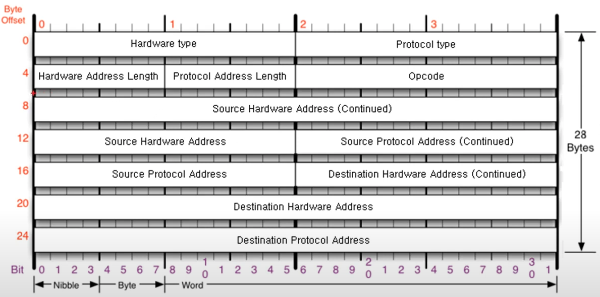

### [ARP 프로토콜](https://youtu.be/LDsp-Xb168E?list=PL0d8NnikouEWcF1jJueLdjRIC4HsUlULi)

#### ARP(주소 해석 프로토콜) 역할

- 같은 네트워크 대역 내에서 IP 주소로부터 MAC 주소를 찾는 프로토콜
- IP 주소만 입력해도, 컴퓨터는 자동으로 상대방의 MAC 주소를 찾고 통신을 수행

#### ARP 프로토콜 구조



- 총 28바이트로 구성
- 주요 필드:
  - 출발지/목적지 MAC 주소 (6바이트씩)
  - 출발지/목적지 IP 주소 (4바이트씩)
  - 하드웨어 타입(0001), 프로토콜 타입(0800), 길이(0604)
  - opcode(000?): 요청(1)인지, 응답(2)인지 판별
- ARP 요청 시 목적지 MAC 주소는 'FF:FF:FF:FF:FF:FF
  '로 브로드캐스트하여 네트워크 전체에 패킷 전달

#### ARP 프로토콜의 통신 과정

##### 1. ARP 요청 (ARP Request)

ARP 요청은 IP 주소만 알고 있는 상태에서 MAC 주소를 알아내기 위한 첫 번째 단계로, 네트워크 상의 모든 기기에게 브로드캐스트된다.

- ARP 요청 패킷 구성:

  - 출발지 MAC 주소와 출발지 IP 주소: 요청을 보낸 기기의 주소
  - 목적지 MAC 주소: 아직 알 수 없으므로 'FF:FF:FF:FF:FF:FF'로 브로드캐스트 설정
  - 목적지 IP 주소: 알고 싶은 기기의 IP 주소

- ARP 요청 전송:
  - 출발지 기기(A)가 ARP 요청 패킷을 생성하여 네트워크에 브로드캐스트로 전송
  - 이 패킷을 네트워크 상의 모든 기기(B, C, D 등)가 수신함

##### 2. ARP 요청 패킷 수신 및 처리

네트워크 내 모든 기기는 ARP 요청을 수신한 후, 자신의 IP 주소와 요청에 포함된 목적지 IP 주소를 비교하여 응답 여부를 결정한다.

- 수신 기기의 응답 결정:
  - 요청을 수신한 각 기기는 자신의 IP 주소와 요청의 목적지 IP 주소를 비교
  - IP 주소가 일치하지 않는 기기는 요청 패킷을 무시
  - IP 주소가 일치하는 기기(예: B)는 자신의 MAC 주소를 응답 패킷에 포함하여 응답할 준비를 함

##### 3. ARP 응답 (ARP Reply)

요청 IP 주소와 일치하는 기기(B)는 ARP 응답을 만들어 요청을 보낸 기기(A)에게 전송한다.

- ARP 응답 패킷 구성:

  - 출발지 MAC 주소와 출발지 IP 주소: 요청을 수신한 기기(B)의 주소
  - 목적지 MAC 주소와 목적지 IP 주소: 요청을 보낸 기기(A)의 주소

- ARP 응답 전송:

  - ARP 응답은 브로드캐스트가 아닌 유니캐스트로 요청을 보낸 기기(A)에게만 전송
  - B 기기가 A 기기에게 자신의 MAC 주소를 포함한 ARP 응답을 보내게 됨

##### 4. ARP 테이블에 정보 저장

ARP 응답을 받은 A 기기는 B의 MAC 주소를 자신의 ARP 테이블에 저장해 다음 통신에 활용할 수 있다.

- 저장 정보:
- B의 IP 주소와 MAC 주소 매핑 정보를 ARP 테이블에 기록
- 해당 정보는 일정 시간 동안 유지되며, 유효 시간이 지나면 삭제되어 다시 요청 필요

##### 5. 후속 통신 진행

A와 B 기기는 ARP 프로토콜을 통해 서로의 MAC 주소를 확인하였으므로 이후 통신은 IP와 MAC 주소를 통해 직접 진행할 수 있다. ARP 요청 없이 바로 데이터 패킷을 주고받을 수 있어 통신 효율이 높아진다.

#### ARP 캐시 테이블

```
인터페이스: xxx.xxx.xxx.xxx --- 0x11
  인터넷 주소           물리적 주소           유형
  xxx.xxx.xxx.xxx      xx-xx-xx-xx-xx-xx   동적
  xxx.xxx.xxx.xxx      xx-xx-xx-xx-xx-xx   정적
  ...
```

##### 1. ARP 테이블의 역할

- 네트워크 상의 기기들이 같은 네트워크 대역 내 다른 기기들과 통신할 때, 매번 ARP 요청을 보내지 않고 이미 알아둔 MAC 주소 정보를 캐시에 저장하여 재사용함
- 캐시에 저장된 MAC 주소 정보를 이용해 통신 지연을 줄이고 네트워크 효율을 높임

##### 2. 구성 요소

- IP 주소: 통신 대상의 IP 주소
- MAC 주소: 해당 IP 주소에 연결된 네트워크 기기의 물리적 주소
- 인터페이스: 네트워크 기기가 연결된 인터페이스 (예: Ethernet)
- 유효 기간 (TTL, Time To Live): 각 항목의 유효 기간으로, 일정 시간이 지나면 해당 항목이 삭제되어 새롭게 ARP 요청이 필요함

##### 3. ARP 테이블의 작동 방식

- ARP 요청을 통해 MAC 주소를 알아낸 후, 해당 정보를 ARP 테이블에 저장
- 일정 시간이 지나면 유효 시간이 만료되어 정보가 삭제되며, 필요 시 재요청을 통해 다시 저장

##### 4. ARP 테이블 확인 방법

- Windows: 명령어 arp -a를 사용하여 현재 ARP 테이블의 내용을 확인할 수 있음
- Linux/MacOS: ip neigh show 또는 arp -n 명령어로 확인 가능
- 결과는 각 IP 주소와 해당하는 MAC 주소의 리스트 형태로 표시되며, 해당 정보를 통해 네트워크 상의 기기들과 빠르게 통신 가능

### [ARP 프로토콜 실습](https://youtu.be/-M_S50Ga384?list=PL0d8NnikouEWcF1jJueLdjRIC4HsUlULi)

#### 1. ARP 캐시 테이블 확인

- cmd에서 arp -a 명령어를 통해 ARP 캐시 테이블을 확인
- ARP는 같은 네트워크 대역 내에서만 사용 가능, 다른 네트워크로는 브로드캐스트가 전달되지 않음
- 네트워크 보안 공부 시, ARP 스푸핑 같은 보안 위협이 발생할 수 있음

#### 2. 와이어샤크로 ARP 패킷 캡처

- 와이어샤크를 통해 ARP 패킷을 캡처
- 필터에 arp를 입력하여 ARP 패킷을 확인
- 요청(Request) 패킷: 정보 요청 시 '?'로 표시됨
- 응답(Reply) 패킷: 상대방이 정보 응답 시 '?' 표시 없음

#### 3. ARP 요청 패킷 분석

- 필드 구조:
  - 하드웨어 타입: 0x0001 (이더넷)
  - 프로토콜 타입: 0x0800 (IPv4)
  - 하드웨어 주소 길이: 6 (MAC 주소 길이)
  - 프로토콜 주소 길이: 4 (IP 주소 길이)
  - 오퍼레이션 코드: 1 (요청)
  - 출발지 MAC 주소: 요청을 보내는 컴퓨터의 MAC 주소
  - 목적지 MAC 주소: 알 수 없으므로 0으로 표시
  - 목적지 IP 주소: 통신 대상의 IP 주소
- 브로드캐스트 주소 FF:FF:FF:FF:FF:FF로 모든 장치에게 전송

#### 4. ARP 응답 패킷 분석

- 응답 패킷은 요청을 받은 장치가 자신의 MAC 주소를 포함해 응답
- 오퍼레이션 코드: 2 (응답)
- 목적지 MAC 주소는 요청자의 MAC 주소로 설정되어 유니캐스트 전송

#### 5. 프레임 최소 크기 패딩

- 이더넷 프레임의 최소 크기는 60바이트로, ARP 패킷과 이더넷 패킷의 합이 60바이트에 미치지 않으면 패딩 추가

#### 6. 최대 프레임 크기

- 이더넷 프레임의 최대 크기는 1514바이트
