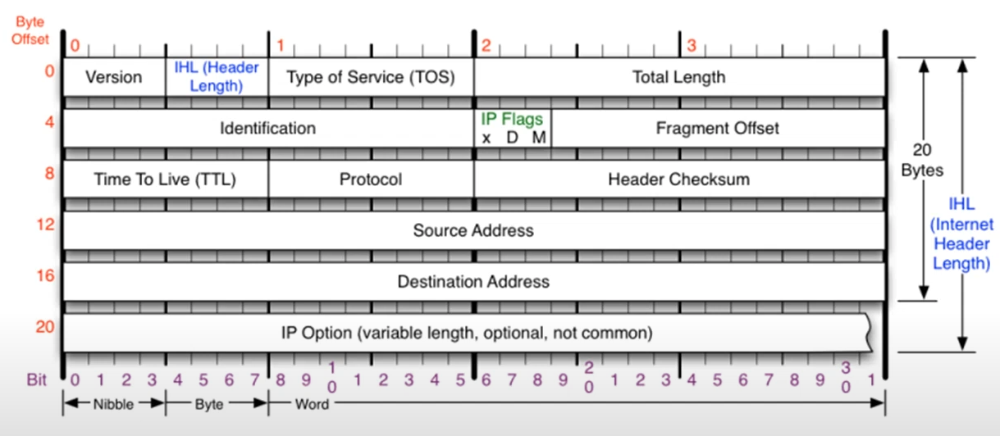

### [IPv4 프로토콜](https://youtu.be/_i8O_o2ozlE?list=PL0d8NnikouEWcF1jJueLdjRIC4HsUlULi)

#### 1. IP 버전 4(IP v4) 프로토콜 역할

- 네트워크에서 멀리 있는 컴퓨터와 데이터를 교환하기 위한 3계층 프로토콜
- 전달 경로와 최적의 경로 설정을 담당하며, 데이터의 정확한 전달 여부는 보장하지 않음 (4계층에서 보장)

#### 2. IP 패킷 구조



- 총 20바이트 기본 구조 + 옵션 필드 (최대 60바이트)
- 필드 구성:

  - **버전(4Bit)** : IP 프로토콜 버전을 나타내며, IPv4는 항상 "4"로 고정
  - **헤더 길이(4Bit)** : IP 헤더의 길이를 4바이트 단위로 나타내며, 옵션이 없는 경우 5 (20바이트), 옵션이 있을 경우 최대 15 (60바이트)
  - **TOS (1Byte,** 현재 사용 안 함) : 기본값 00
  - **총 길이(2Byte)** : 상위 계층까지 합친 헤더와 데이터 전체 길이
  - **ID(2Byte)** : 패킷이 쪼개져 있을 때 원래 데이터임을 식별하는 값 (같은 데이터 -> 같은 아이디)
  - **IP Flags(3Bit)** : x, Dont Flag, More Flag / More Flag만 사용하는데 추가 패킷데이터가 더 있다는 걸 알려줌
  - **플래그 오프셋(13Bit)** : 데이터가 조각화되어 전송될 경우, 재조립을 위한 위치와 상태 정보를 나타냄
    <details>
    <summary>Fragment Offset이 허용 범위를 벗어나는 경우</summary>

    해당 패킷은 잘못된 것으로 간주되어 수신 측에서 폐기됨

    - 프래그먼트 오프셋 필드의 한계: IPv4 헤더에서 프래그먼트 오프셋은 13비트 필드로, 0부터 8191까지의 값을 가질 수 있음
    - 하지만 이 값은 8바이트 단위로 계산되므로 실제로 나타낼 수 있는 최대 오프셋은 8191 × 8 = 65,528바이트
    - IP 패킷의 최대 크기: IPv4에서 패킷의 총 길이는 16비트 필드로 표현되며, 최대 값은 65,535바이트
    - 따라서 프래그먼트 오프셋과 데이터 길이의 합이 이 값을 초과하면 안 됨
    </details>

  - **TTL(1Byte)** : 패킷이 네트워크에서 살아남을 수 있는 최대 시간으로, 네트워크 장비를 지날 때마다 감소하며 0이 되면 패킷 폐기 / 윈도우: 128, 리눅스: 64
  - **프로토콜(1Byte)** : 상위 계층의 프로토콜 타입 / ICMP: 01, TCP: 06, UDP: 17(16진수로는 11)
  - **체크섬(2Byte)** : 헤더 오류 검사를 위한 값
  - **출발지 IP 주소(4Byte)**
  - **목적지 IP 주소(4Byte)**

- 옵션 필드는 상황에 따라 추가되며 최대 10개 옵션까지 사용 가능

#### 3. 데이터 조각화 (Fragmentation)

- 데이터가 최대 전송 단위(MTU)를 초과하면 쪼개서 전송하며, ID와 오프셋을 통해 수신자가 재조립 가능하도록 함

### [ICMP 프로토콜](https://youtu.be/JaBCIUsFE74?list=PL0d8NnikouEWcF1jJueLdjRIC4HsUlULi)

#### ICMP(Internet Control Message Protocol) 프로토콜 역할

- 인터넷 제어 메시지 프로토콜로, 네트워크에서 제어 메시지를 주고받음
- 주로 상대방과의 통신 상태를 확인하기 위해 사용 (Ping 테스트 등)

#### ICMP 패킷 구조


- 타입, 코드, 체크섬으로 간단한 구조
- 타입: 메시지의 대분류
- 코드: 타입에 대한 세부 분류
- 체크섬: 오류 검사

#### 주요 타입 및 코드 설명

- 타입 8 (요청), 타입 0 (응답): Ping 테스트에서 사용
  - 8번: 요청 메시지 (Ping 전송)
  - 0번: 응답 메시지 (Ping 응답)
- 타입 3 (Destination Unreachable): 목적지 도달 불가
  - 네트워크 경로에서 문제 발생 시 사용
- 타입 11 (Time Exceeded): TTL 초과
  - 경로는 문제없으나 목적지에서 응답이 오지 않을 때 사용 (예: 방화벽에 의해 차단된 경우)
- 타입 5 (Redirect): 리다이렉트 메시지 (보안 이슈로 현재는 거의 사용되지 않음)
  - 원격지 라우팅 테이블 수정 요청으로, 보안상 문제가 되어 현재는 거의 사용되지 않음

#### ICMP를 통한 네트워크 문제 해결

- 타입 3, 11 메시지로 네트워크 문제 원인 파악 가능
  - 타입 3: 중간 경로에서 문제 (라우터 경로 오류 등)
  - 타입 11: 목적지에서의 문제 (방화벽 등)

### [IPv4, ICMP프로토콜 실습](https://youtu.be/8ZwTvTuZlVw?list=PL0d8NnikouEWcF1jJueLdjRIC4HsUlULi)

#### 1. Wireshark 패킷 캡쳐

- 로컬 네트워크에서 패킷을 캡쳐하여 IP 프로토콜 패킷 구조를 확인
- ping 명령어 사용하여 특정 IP로 요청을 보내고, icmp 필터 적용해 해당 패킷들만 분석

#### 2. ICMP 프로토콜 분석

- ICMP 구조: 8바이트의 헤더로 구성, 요청 시 타입은 8, 응답 시 0
- 추가 데이터: 기본적으로 ICMP 패킷에는 A-Z 문자 데이터가 포함됨 (총 32바이트)
- 주요 필드:
  - 타입: 요청(8), 응답(0)
  - 식별자(ID): 요청과 응답을 식별하는 용도

#### 3. IP 프로토콜 필드

- 버전과 헤더 길이: IP 버전(4)과 헤더 길이(5, 20바이트)
- 총 길이: ICMP 데이터(32바이트) + ICMP 헤더(8바이트) + IP 헤더(20바이트) = 총 60바이트
- ID: 패킷 식별자로, 각 패킷마다 고유하게 할당
- 플래그: 데이터 조각화 여부 표시
  - 조각화 필요 시 설정 (현재는 데이터가 작아 조각화되지 않음)
- TTL(Time to Live): 윈도우 기본 128, 패킷이 네트워크 장비를 지날 때마다 1씩 감소
- 프로토콜: 상위 프로토콜 타입(ICMP=1, TCP=6, UDP=17 등)
- 체크섬: 헤더 오류 확인용 (패킷 무결성 검사)

#### 4. IP 프로토콜 구조의 특징

- 동일 네트워크와 다른 네트워크: 같은 네트워크 내 통신은 간단하지만, 다른 네트워크로 전송 시 IP 프로토콜 구조가 동일하더라도 2계층 프로토콜(이더넷)은 중간 네트워크 장비에 따라 변환 가능

### [라우팅 테이블](https://youtu.be/CjnKNIyREHA?list=PL0d8NnikouEWcF1jJueLdjRIC4HsUlULi)

#### 1. 라우팅 테이블 역할

```
IPv4 경로 테이블
===========================================================================
활성 경로:
네트워크 대상      네트워크 마스크         게이트웨이         인터페이스    메트릭
    0.0.0.0            0.0.0.0   xxx.xxx.xxx.xxx   xxx.xxx.xxx.xxx      xxx
  127.0.0.0          255.0.0.0             연결됨         127.0.0.1      xxx
  127.0.0.1    255.255.255.255             연결됨         127.0.0.1      xxx
  ...
```

- 네트워크 장비가 IP 패킷을 최적의 경로로 전송하기 위한 "지도" 역할을 함
- `netstat -r` 명령어로 확인 가능하며, 라우팅 테이블에 등록된 네트워크 대역만 찾아갈 수 있음
- 기본 게이트웨이 설정(0000)을 통해 모르는 네트워크는 게이트웨이를 통해 외부로 전송

#### 2. 라우팅 테이블 설정과 라우터 역할

- 네트워크 엔지니어가 라우터를 설정하여 네트워크 장비가 목적지로 가는 경로를 알 수 있게 함
- 라우터는 라우팅 테이블에 따라 IP 패킷을 전달하며, 네트워크 대역이 바뀔 때마다 이더넷 프로토콜을 새로 작성

#### 3. 멀리 있는 컴퓨터와 통신 과정 (예시)

- 과정 요약:

  - A 컴퓨터가 B 컴퓨터(다른 네트워크 대역에 있음)와 통신하려고 함
  - A의 라우팅 테이블을 확인해 B 네트워크 대역으로 가는 경로를 찾고, 그 경로의 중간 지점인 라우터로 패킷을 보냄
  - IP 프로토콜 작성 (출발지/목적지 IP 주소 등) + ICMP 프로토콜 작성 (요청: 8, 응답: 0)

- 이더넷 프로토콜 작성 및 통신 과정:

  - 이더넷 프로토콜은 인접한 네트워크 장비끼리 MAC 주소를 이용해 전송하며, 최종 목적지가 아닌 가장 가까운 라우터로 패킷을 보냄
  - A -> 첫 번째 라우터(R1): A가 목적지 MAC 주소에 R1의 MAC 주소를 지정하고 패킷을 전송
  - R1 -> 두 번째 라우터(R2): R1이 목적지 IP를 확인하고 R2로 패킷을 전달
  - 이러한 과정이 반복되어, 네트워크 대역이 바뀔 때마다 이더넷 프로토콜을 새로 작성하여 인접한 라우터에 전달
  - 최종적으로 B 네트워크 대역에 도달하면 B가 패킷을 수신함

#### 4. ARP 활용

- ARP 요청을 통해 MAC 주소가 필요한 경우 해당 MAC 주소를 확인하여 라우팅 과정에서 사용

#### 5. 핑(Ping) 명령어의 작동

- ing 명령어는 ICMP 요청과 응답을 반복하여 네트워크 연결 확인
- 요청-응답 간 ARP 요청까지 포함해 총 4번의 통신이 이루어짐

### [IPv4 조각화 이론](https://youtu.be/_AONcID7Sc8?list=PL0d8NnikouEWcF1jJueLdjRIC4HsUlULi)

#### 1. 조각화(Fragmentation) 개요

- IP 패킷의 최대 전송 단위(MTU)는 네트워크 장비마다 다르며, 일반적으로 1500바이트로 설정
- IP 패킷이 MTU보다 크면 조각화 과정을 통해 데이터를 잘게 쪼개어 전송
- MTU 값에는 IP 헤더(20바이트)가 포함되므로, 실제 데이터 페이로드는 MTU에서 20바이트를 뺀 값으로 나뉨

#### 2. 조각화 과정 예시

- 예를 들어 12,000바이트의 데이터가 MTU가 3300바이트인 네트워크를 통해 전송된다면:
  - IP 헤더(20바이트)를 제외하고 최대 3280바이트씩 쪼개어 전송
- 계산 방식:
  - 데이터 12,000바이트 / 3280바이트 ≈ 4조각으로 나눔
  - 첫 번째 조각: 0부터 시작, 플래그는 "More Fragments"로 설정
  - 두 번째 조각: 첫 조각 크기만큼 떨어진 위치에서 시작 (오프셋 3280/8 = 410 설정)
  - 세 번째 조각: 앞 조각들 크기 누적 오프셋 설정
  - 마지막 조각: 플래그를 "No More Fragments"로 설정하여 패킷 종료

#### 3. 주요 필드

- ID: 동일 데이터임을 식별할 수 있도록 모든 조각에 동일한 ID 부여
- 오프셋(Offset): 각 조각의 시작 위치를 나타내며, 8바이트 단위로 저장
- 플래그(Flags):
  - 첫 비트: 사용 안 함
  - 두 번째 비트: 조각화 금지 설정 (일반적으로 사용 안 함)
  - 세 번째 비트: More Fragments 설정 (다음 조각이 있는지 여부 표시)

#### 4. MTU가 작은 네트워크 장비를 만날 때

- 여러 네트워크 장비가 서로 다른 MTU 값을 갖고 있을 때, 작은 MTU 값의 장비를 만날 경우 다시 조각화
- 예시: MTU 1500바이트인 장비를 만난다면 데이터는 1480바이트씩 더 잘게 나뉘어 전송

#### 5. 패킷 조립 과정

- 수신 측에서는 ID, 플래그, 오프셋 값을 참조하여 원래 데이터로 복원
- 각 조각을 오프셋 순서대로 배치해 원본 데이터를 조립

#### 6. TTL 및 상위 프로토콜

- TTL(Time to Live): 경로를 지나는 네트워크 장비마다 1씩 감소하여 0이 되면 폐기, 루프 방지 기능
- 상위 프로토콜 필드: ICMP, TCP, UDP 등 상위 프로토콜 타입을 나타냄

### [IPv4 조각화 실습](https://youtu.be/QKEL9aBgHtg?list=PL0d8NnikouEWcF1jJueLdjRIC4HsUlULi)

#### 1. 문제 조건

- 보내려는 데이터 크기: 4800 바이트
- MTU (최대 전송 단위): 1500 바이트
- IP 버전 4 헤더 크기: 20 바이트

#### 2. 조각화 과정

- IP 헤더(20 바이트)를 제외한 데이터는 최대 1480 바이트씩 전송 가능
- 4800 바이트 데이터를 1480 바이트 단위로 나눠 전송

#### 3. 패킷 나누기

- 첫 번째 패킷: 1480 바이트 데이터
- 두 번째 패킷: 1480 바이트 데이터
- 세 번째 패킷: 1480 바이트 데이터
- 네 번째 패킷: 460 바이트 데이터 (마지막 패킷)

#### 4. 필드 설정

- MF (More Fragments) 비트: 첫 번째, 두 번째, 세 번째 패킷은 MF=1, 마지막 패킷은 MF=0
- 오프셋: 바이트 수를 8로 나눈 값
  - 첫 번째 패킷: 오프셋=0
  - 두 번째 패킷: 오프셋=185
  - 세 번째 패킷: 오프셋=370
  - 네 번째 패킷: 오프셋=555

#### 5. 결과 요약

- 패킷 개수: 4개
- 첫 번째 패킷 데이터 크기: 1480 바이트
- 마지막 패킷 데이터 크기: 460 바이트
