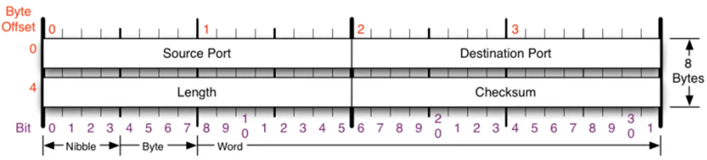

### [UDP 프로토콜](https://youtu.be/3MkI3FBFzX8?list=PL0d8NnikouEWcF1jJueLdjRIC4HsUlULi)

#### 1. UDP 프로토콜 개요

- UDP: 사용자 데이터그램 프로토콜(User Datagram Protocol)로 단순한 전송 방식의 비연결 지향형 프로토콜
- 특징:
  - 연결 상태를 지향하지 않음 → 신뢰성이 낮음
  - 데이터 전송 중 오류 검증, 재전송 요청 기능 없음

#### 2. UDP 헤더 구조

1. 출발지 포트 번호 (2바이트)
1. 목적지 포트 번호 (2바이트)
1. 길이 (UDP 헤더 + 페이로드 길이 포함)
1. 체크섬 (데이터 손상 여부 확인)

#### 3. UDP를 사용하는 프로그램 예시

- DNS 서버
  - 도메인 주소를 IP 주소로 변환할 때 사용
- TFTP (Trivial File Transfer Protocol)
  - 파일 전송 프로토콜
- 라우터 동적 라우팅 프로토콜 (RIP)
  - 라우터 간 라우팅 테이블 정보를 공유

### [tftpd로 파일 전송 실습](https://youtu.be/5Woau-EJChw?list=PL0d8NnikouEWcF1jJueLdjRIC4HsUlULi)

#### 1. TFTP 서버 및 클라이언트 설정 개요

- 서버 설정 (윈도우 7)

  - TFTP 서버 실행: TFTP 프로그램을 설치 후 압축만 풀어서 실행
  - 전송할 파일 생성: 서버에 TFTP 실행 파일이 있는 위치에 메모장 파일 생성 (내용은 자유)
  - 서버 인터페이스 설정: 실제 사용하는 네트워크 어댑터 IP 주소로 설정 (예: 192.168.x.x)

- 클라이언트 설정 (윈도우 XP)

  - 클라이언트 탭에서 서버 IP 및 포트 설정:
    - 서버 IP 주소 입력
    - 포트 번호는 기본적으로 69 사용 (TFTP 표준 포트)
  - 파일 다운로드 설정:
    - 로컬 파일 이름: 다운로드 후 저장할 파일명
    - 리모트 파일 이름: 서버에서 설정한 파일명과 동일하게 설정
  - 파일 전송 시작: "GET" 버튼을 눌러 파일 다운로드

#### 2. TFTP의 UDP 전송 특성 및 장단점

- UDP 전송 장단점:

  - UDP는 신뢰성 보장 없이 빠르게 데이터 전송 (중간에 데이터 손실 시 재전송 불가)
  - 일반적인 파일 전송에는 비효율적일 수 있음 (손상 시 복구 불가)
  - 큰 파일 전송에 적합하지 않음
  - 동영상 스트리밍에 효율적

- TFTP의 특수 용도:

  - 운영체제 미설치 컴퓨터에 OS image 전달
  - 다수의 컴퓨터에 운영체제 동시 설치 시 사용

#### 3. 와이어샤크를 통한 패킷 캡처 및 분석

- 패킷 캡처 설정:

  - 와이어샤크에서 네트워크 장치 선택 (예: VMNet8 가상 네트워크 어댑터)
  - "Start"를 눌러 캡처 시작

- 패킷 분석:

  - TFTP 프로토콜을 통해 전송되는 UDP 패킷 분석
  - UDP 헤더 구조:
  - 출발지 포트 (예: 1046)
  - 목적지 포트 (69)
  - 길이 (헤더+데이터 포함 32바이트)

- UDP 전송 구조:

  - UDP 헤더 (8바이트) + 페이로드 (예: 24바이트) = 총 32바이트
  - IP 및 이더넷 계층 헤더와 함께 전송
