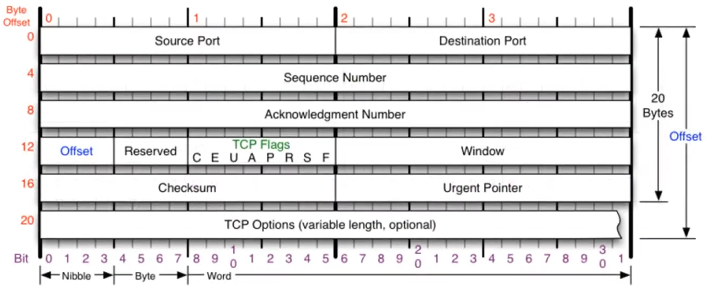
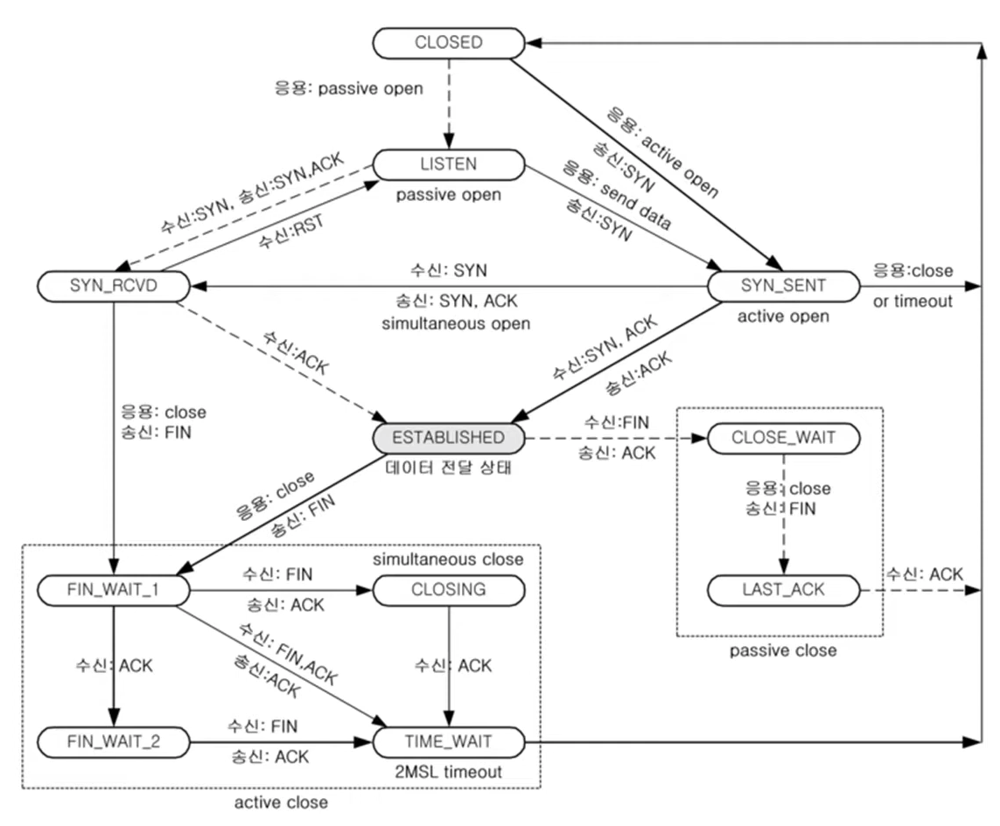

### [TCP 프로토콜](https://youtu.be/cOK_f9_k_O0?list=PL0d8NnikouEWcF1jJueLdjRIC4HsUlULi)

#### 1. TCP 프로토콜 개요

- TCP (Transmission Control Protocol): 연결 지향형 프로토콜로 UDP와 달리 안정적이고 순서에 맞춰 데이터 전달 가능
- 특징:
  - 안정적 통신: 오류 검출, 재전송, 순서 보장
  - UDP에 비해 속도는 느리지만 체감하기 어려운 수준

#### 2. TCP 헤더 구조



- **출발지 포트 번호 (2바이트)**
- **목적지 포트 번호 (2바이트)**
- **시퀀스 번호 (4바이트)**: 데이터 순서 지정
- **에크놀리지 번호 (4바이트)**: 응답 및 수신 확인
- **오프셋**: 헤더 길이
- **예약 필드**: 사용하지 않는 공간
- **플래그**: 데이터 통신 상태 및 동작을 정의하는 비트 필드
- **윈도우 크기**: 수신 가능한 데이터 용량 표시
- **체크섬**: 데이터 손상 여부 확인
- **긴급 포인터**: 긴급 데이터 위치 표시
- **옵션**: 추가 정보 포함 가능, 최대 40바이트

#### 3. TCP 플래그 및 기능

- **URG (긴급 비트)**: 긴급 데이터가 포함된 경우 우선 처리 요청
- **ACK (승인 비트)**: 수신 확인 및 연결 응답
- **PSH (푸시 비트)**: 버퍼가 차기 전에 데이터를 즉시 전송
- **RST (리셋 비트)**: 연결 초기화 요청
- **SYN (동기화 비트)**: 초기 연결 설정에 사용
- **FIN (종료 비트)**: 연결 종료 요청

#### 4. TCP와 UDP 비교

- TCP: 연결 지향, 신뢰성 높음, 순서 보장, 느리지만 안정적
- UDP: 비연결 지향, 신뢰성 낮음, 순서 미보장, 속도 빠름

### [TCP 3Way Handshake](https://youtu.be/Ah4-MWISel8?list=PL0d8NnikouEWcF1jJueLdjRIC4HsUlULi)

#### 1. TCP 통신 과정 개요

- 연결 지향적 통신: TCP는 데이터 전달 과정에서 계속 통신 상태를 확인하며 안정적 전송을 보장
- 3-way Handshake: 연결 수립을 위한 3단계 과정
  - 클라이언트 → 서버: 연결 요청 패킷 전송 (SYN)
  - 서버 → 클라이언트: 응답 및 요청 (SYN + ACK)
  - 클라이언트 → 서버: 응답 (ACK)
- 3-way Handshake는 악수를 통해 연결을 확립하는 과정으로 비유됨

#### 2. TCP 3-way Handshake 동작 예시

- 클라이언트: 연결 요청 (SYN 플래그 세팅, 시퀀스 번호 임의 지정)
- 서버: 연결 승인 (SYN + ACK 플래그 세팅, 클라이언트의 시퀀스 번호 +1로 에크 번호 지정)
- 클라이언트: 최종 승인 (ACK 플래그 세팅, 서버의 시퀀스 번호 +1로 에크 번호 지정)

#### 3. 보안 위험: 세션 하이재킹

- 세션 하이재킹 개념: 공격자가 시퀀스와 에크 번호를 추정하여 TCP 통신에 끼어들어 정상적인 클라이언트 대신 서버와 연결
- 위험성: 해커가 통신을 가로채면, 로그인이 완료된 상태로 중요한 정보에 접근 가능

#### 4. 중요 포인트 요약

- TCP 연결 수립 시 3-way Handshake 과정 필수
- 시퀀스 및 에크 번호를 통한 동기화로 안정적 데이터 전송
- 보안 위험을 줄이기 위해 세션 하이재킹 방지 기술 필요

### [TCP를 이용한 데이터 전송 과정](https://youtu.be/0vBR666GZ5o?list=PL0d8NnikouEWcF1jJueLdjRIC4HsUlULi)

#### 1. 데이터 전송 과정

- 주요 규칙 요약:

  1. **같은 송신 측에서 재전송 시**: SEQ 번호와 ACK 번호는 변경되지 않음
  2. **수신 측에서 SEQ 번호**: 이전에 받은 ACK 번호를 SEQ 번호로 사용
  3. **수신 측에서 ACK 번호**: 받은 SEQ 번호에 데이터 크기를 더한 값을 사용

- 예시:

  - 클라이언트가 서버에 데이터 100바이트를 보냈다면 서버는 시퀀스 번호에 100을 더해 ACK 번호를 보냄

- 데이터 밀어넣기 (Push) & ACK 설정:

  - Push 플래그: 데이터를 강제로 밀어넣을 때 설정
  - ACK 플래그: 잘 받았는지 확인 요청

- 데이터 응답:

  - 서버가 클라이언트에게 응답할 때, 받은 데이터 크기만큼 ACK 번호 증가
  - 클라이언트는 최종 데이터까지 수신한 후 ACK로 응답

#### 2. 연결 종료 (Three-Way Handshake가 아닌 경우)

- 프로그램에 따라 다르게 구현 가능
- 종료 시 기본적으로 받은 시퀀스 번호와 ACK 번호 규칙만 준수

### [TCP의 연결 상태 변화](https://youtu.be/yY0uQf0BTH8?list=PL0d8NnikouEWcF1jJueLdjRIC4HsUlULi)



#### 1. TCP 연결의 주요 상태

- CLOSED: 연결이 닫혀 있는 상태
- **LISTEN**: 서버가 포트를 열고 클라이언트의 연결 요청을 기다리는 상태
- SYN-SENT: 클라이언트가 연결 요청(SYN 패킷)을 보낸 상태
- SYN-RECEIVED: 서버가 클라이언트의 SYN 패킷을 받고, 응답(SYN + ACK)을 보낸 상태
- **ESTABLISHED**: 클라이언트와 서버가 연결된 상태 (데이터 전송 가능)
- FIN-WAIT, TIME-WAIT, CLOSE-WAIT 등: 연결 종료를 위한 상태들

#### 2. TCP 연결 수립 과정 (Three-Way Handshake)

```
┌───────────────────────────┐        ┌───────────────────────────┐
│           Client          │        │         Web Server        │
│     (state: SYN_SENT)     │        │     (state: LISTENING)    │
└───────────────────────────┘        └───────────────────────────┘
             │                                   │ Listning
             │        1. SYN (S:100, A:0)        │
             ├──────────────────────────────────▶│
             │                                   │
    Syn_sent │                                   | Syn_receieved
             │    2. SYN + ACK (S:2000, A:101)   │
             │◀──────────────────────────────────┤
             │                                   │
             │                                   │
             │       3. ACK (S:101, A:2001)      │
             ├──────────────────────────────────▶│
 Established │                                   │ Established
```

- 1단계: 클라이언트가 서버에 SYN 패킷을 보냄 (상태: SYN-SENT)
- 2단계: 서버가 SYN 패킷을 받고, SYN + ACK 패킷으로 응답 (상태: SYN-RECEIVED)
- 3단계: 클라이언트가 서버의 SYN + ACK를 받고, ACK 패킷으로 응답 (상태: ESTABLISHED)

#### 3. 연결 종료 과정 (Four-Way Handshake)

- 1단계: 클라이언트가 FIN 패킷을 보냄 (상태: FIN-WAIT-1)
- 2단계: 서버가 FIN을 받고 ACK 패킷으로 응답 (상태: CLOSE-WAIT)
- 3단계: 서버가 FIN 패킷을 보냄 (상태: LAST-ACK)
- 4단계: 클라이언트가 FIN을 받고 ACK로 응답 후 TIME-WAIT 상태를 거쳐 연결 종료

#### 4. 클라이언트와 서버의 연결 방식

- 클라이언트: 능동적으로 연결을 요청 (Active Open)
- 서버: 수동적으로 요청을 대기 (Passive Open)

#### 5. 중요 개념

- LISTEN 상태: 서버가 포트를 열고 클라이언트의 요청을 대기
- ESTABLISHED 상태: 연결이 완료되어 데이터 통신 가능
- Three-Way Handshake 이후 ESTABLISHED 상태가 되어야 통신이 가능

### [TCP 프로토콜 분석 실습](https://youtu.be/WseqBDo-j3Y?list=PL0d8NnikouEWcF1jJueLdjRIC4HsUlULi)

#### 1. 캡처 시작 및 필터 설정:

- 와이어샤크에서 로컬 네트워크 연결을 통해 캡처 시작
- 웹 브라우저로 웹 사이트에 접속하면 네트워크 패킷이 자동으로 캡처됨
- tcp 필터를 설정하면 TCP 패킷만 선별하여 볼 수 있음

#### 2. TCP 스트림 보기

- 특정 TCP 패킷을 우클릭하고 Follow → TCP Stream을 선택하면 해당 스트림의 주고받은 데이터를 따로 볼 수 있습니다.
- 이 기능을 통해 한 세션의 TCP 통신 흐름을 확인할 수 있습니다.

#### 3. Flow Graph 사용:

- Statistics > Flow Graph 기능을 통해 통신 흐름을 시각적으로 확인 가능.
- 특정 IP 간의 패킷 주고받은 내역을 간단하게 그래프로 보여줌.
- 디스플레이 필터를 적용해 특정 통신만 집중적으로 분석 가능.

#### 4. 데이터 패킷 분석:

- 각 패킷의 시퀀스 번호와 ACK 번호를 통해 데이터의 흐름을 추적 가능.
- 패킷의 TCP/IP 헤더를 포함한 전체 크기에서 헤더 크기를 제외하여 실제 전송된 데이터 크기를 확인.

#### 5. 시퀀스 번호와 데이터 크기 계산:

- 데이터 크기를 정확히 계산하려면 TCP, IP, Ethernet 헤더 크기를 제외.
  - TCP 헤더: 20바이트
  - IP 헤더: 20바이트
  - Ethernet 헤더: 14바이트
