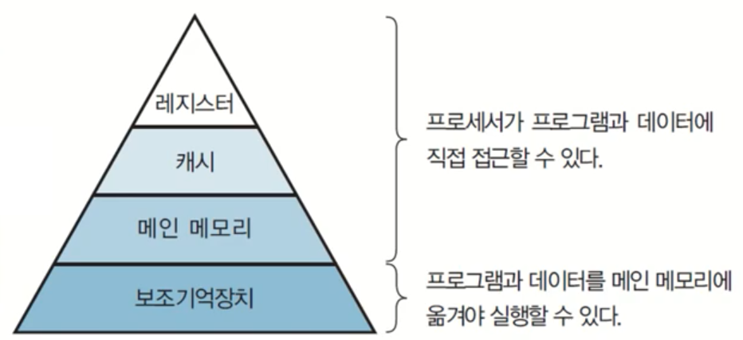

## [Lecture 1: 운영체제 개요](https://www.youtube.com/watch?v=EdTtGv9w2sA&list=PLBrGAFAIyf5rby7QylRc6JxU5lzQ9c4tN&ab_channel=HPCLab.KOREATECH)

### 1. 운영체제(Operating System)의 역할

- 컴퓨터 하드웨어 자원을 효율적으로 관리하고 사용자 및 응용 프로그램에 서비스를 제공하는 소프트웨어
- 주요 자원: CPU, 메모리, 저장장치, 네트워크 장치 등

### 2. 운영체제가 관리하는 주요 하드웨어

#### 프로세서 (Processor)

- CPU, GPU 등 연산과 제어를 담당하는 장치
- 프로세서 내부 메모리인 레지스터가 존재 (데이터, 주소, 상태 저장)
  - 프로세서가 사용할 데이터 저장
  - 컴퓨터에서 가장 빠른 메모리
- 레지스터의 종류
  - 용도에 따른 분류
    - 전용 레지스터,범용 레지스터
  - 사용자가 정보 변경 가능 여부에 따른 분류
    - 사용자 가시 레지스터, 사용자 불가시 레지스터
  - 저장하는 정보의 종류에 따른 분류
    - 데이터 레지스터, 주소 레지스터, 상태 레지스터

#### 메모리 (Memory)

- 컴퓨터에서 데이터를 저장하는 장치
- 메모리의 종류: 레지스터, 캐시, 메인 메모리(DRAM), 보조 기억장치(디스크)
- 메모리 계층 구조
  - 속도 및 가격: 레지스터 > 캐시 > 메인 메모리 > 보조 기억장치
  - 용량: 보조 기억장치 > 메인 메모리 > 캐시 > 레지스터
- 메모리 계층을 통해 병목 현상을 줄이고 성능 최적화

#### 메인 메모리 (Main memory)

- 프로세서가 수행할 프로그램과 데이터 저장
- DRAM을 주로 사용
  - 용량이 크고, 가격이 저렴
- 디스크 입출력 병목현상(I/O bottleneck) 해소 (CPU 속도와 Disk 속도 차이의 완충역할)

#### 캐시 메모리 (Cache)

- CPU 내부에 위치하며, 데이터 접근 속도를 높이기 위해 사용

- 캐시의 동작

  - 캐시 히트 (Cache hit): 필요한 데이터 블록이 캐시에 존재
  - 캐시 미스 (Cache miss): 필요한 데이터 블록이 캐시에 존재하지 않음

- Locality (지역성) 개념 활용: 캐시가 효과를 낼 수 있는 이유

  - 공간적 지역성 (Spatial locality)

    - 참조한 주소와 인접한 주소를 참조하는 특성
    - 예: 순차적 프로그램 수행

  - 시간적 지역성 (Temporal locality)

    - 한 번 참조한 주소를 곧 다시 참조하는 특성
    - 예: For문 등의 순환 문

  - 지역성은 캐시 적중률(cache hit ratio)과 밀접

#### 보조 기억장치 (Secondary Storage)

- 하드디스크, SSD, USB, CD/DVD, SD 카드 등
- 대용량 데이터 저장에 사용되며, CPU가 직접 접근할 수는 없음
- 가상 메모리 (Virtual Memory): 메모리 부족 시 디스크 일부를 메모리처럼 사용

#### 시스템 버스 (System Bus)

- 프로세서, 메모리, 주변장치 간의 통신 통로
- 종류: 데이터 버스, 주소 버스, 제어 버스

#### 주변장치 (Peripheral Devices)

- 입력 장치: 키보드, 마우스, 터치 스크린
- 출력 장치: 모니터, 프린터, 스피커
- 저장 장치: 하드디스크, SSD
- 장치 드라이버: OS와 하드웨어 간의 인터페이스 제공
- 인터럽트 (Interrupt): 주변장치의 요청을 OS에 알리는 신호
