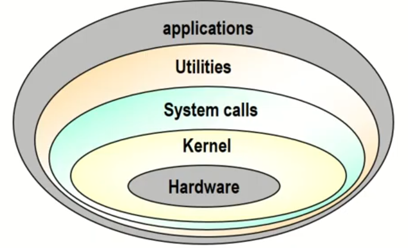

## [Lecture 2-1: OS 개요 - 운영체제의 역할 및 분류 (1/3)](https://www.youtube.com/watch?v=nxl_cUd55Ag&list=PLBrGAFAIyf5rby7QylRc6JxU5lzQ9c4tN&index=3&ab_channel=HPCLab.KOREATECH)

### 1. 운영체제의 주요 역할

- 운영체제는 컴퓨터 하드웨어를 효율적으로 관리하고 사용자와 응용 프로그램에 서비스를 제공
- 운영체제의 역할 4가지:

  1. 유저 인터페이스 (User Interface)

     - 사용자가 시스템을 편리하게 사용할 수 있도록 도와줌
     - GUI (Graphic User Interface): 그래픽 기반 인터페이스 (Windows, macOS 등)
     - CUI (Character User Interface): 문자 기반 인터페이스 (과거의 MS-DOS)
     - End User Comfortable Interface: 특화된 기기용 UI (예: MP3 플레이어)

  2. 리소스 관리 (Resource Management)

     - 하드웨어 및 소프트웨어 자원을 효율적으로 관리
     - CPU, 메모리, 디스크, 네트워크 자원 등을 관리

  3. 프로세스 및 스레드 관리 (Process & Thread Management)

     - 프로세스: 실행 중인 프로그램을 관리
     - 스레드: 가벼운 프로세스로, 여러 작업을 병렬로 수행

  4. 시스템 보호 (System Management)

     - 시스템의 불법적 접근 및 사용을 방지

### 2. 컴퓨터 시스템 구성 요소

- 하드웨어: CPU, 메모리, I/O 장치 등
- 운영체제 (OS): 하드웨어를 제어하고 자원을 관리
- 커널 (Kernel): 운영체제의 핵심 부분, 하드웨어 제어 및 시스템 자원 관리
- 시스템 호출 인터페이스 (System Call Interface)
  - 사용자와 커널 간의 통로 역할
  - 사용자가 커널의 기능을 요청하는 함수 형태의 인터페이스

### 3. 운영체제의 분류

1. 단일 사용자 vs. 다중 사용자 (Single-user vs. Multi-user)

   - 단일 사용자 시스템: 한 번에 한 명만 시스템을 사용
     - 예: Windows, Android, iOS
     - 자원 관리가 비교적 단순하고 보안 구현이 쉬움
   - 다중 사용자 시스템: 여러 사용자가 동시에 시스템을 사용
     - 예: Unix, Linux 서버, 슈퍼컴퓨터
     - 자원 소유권 관리 및 멀티태스킹 기능 필요

2. 단일 작업 vs. 다중 작업 (Single-tasking vs. Multi-tasking)

   - 단일 작업 시스템 (Single-tasking)
     - 한 번에 하나의 프로그램만 실행 가능
     - 예: MS-DOS
   - 다중 작업 시스템 (Multi-tasking)
     - 여러 개의 프로세스를 동시에 실행 가능
     - 예: Windows, Unix, Linux
     - 복잡한 자원 관리 필요

### 4. 추가 개념: 커널과 시스템 호출

- 커널: 운영체제의 핵심 부분으로, 하드웨어와 직접 상호작용
- 시스템 호출 (System Call): 사용자 프로그램이 커널 기능을 요청하는 방식
  - 사용자가 커널을 직접 제어하는 대신, 시스템 호출을 통해 접근

## [Lecture 2-2: OS 개요 - 작업 방식에 따른 운영체제 분류 (2/3)](https://www.youtube.com/watch?v=hzXVQIlSSos&list=PLBrGAFAIyf5rby7QylRc6JxU5lzQ9c4tN&index=4&ab_channel=HPCLab.KOREATECH)

### 0. 순차 처리 (~ 1950s)

- 초기에는 운영체제가 없었음
- 사용자가 직접 기계어로 프로그램 작성, 하드웨어 직접 제어
- 천공 카드 사용: 사용자가 컴퓨터 앞에서 줄을 서서 순서대로 프로그램 실행
- 문제점: 작업마다 세팅 시간이 필요해 컴퓨터 자원 낭비 발생

### 1. 일괄 처리 시스템 (Batch Processing System) (1950s ~ 1960s)

- 서로 다른 작업을 한 번에 모아 처리하여 자원 낭비 줄임
- 특징
  - 동일한 종류의 작업을 모아서 일괄 처리
  - 시스템 효율성 (스루풋) 증대
- 단점
  - 사용자 입장에서 응답 시간이 길어져 생산성 저하
  - 결과를 받기까지 오랜 시간이 소요됨

### 2. 시분할 시스템 (Time-Sharing System) (1960s ~ 1970s)

- 여러 사용자가 동시에 시스템 자원을 공유하는 방식
- 특징: 사용자 지향적 (User-oriented)
  - 대화형(conversational, interactive) 시스템
  - 단말기(CRT terminal) 사용
- 장점
  - 사용자 입장에서 응답 시간이 단축됨
  - 생산성 향상: 프로세서 유휴 시간 감소
- 단점
  - 통신 비용 증가, 보안 문제 발생
  - 많은 사용자가 접속 시 성능 저하 (개인 사용자 체감 속도 저하)

### 3. 개인용 컴퓨터 시스템 (Personal Computing)

- 개인이 시스템 전체를 독점적으로 사용
- 특징
  - 사용자 편의성 중심으로 운영체제 설계
  - 시스템 활용률보다 사용자 경험 향상이 중요
  - 운영체제가 상대적으로 단순화됨
- 단점
  - 성능이 제한적일 수 있음

### 4. 병렬 처리 시스템 (Parallel Processing System)

- 단일 시스템 내에서 여러 개의 프로세서를 사용하여 작업 성능 향상
- 메모리 자원 공유 (Tightly Coupled System)
  - CPU 여러 개가 메모리와 자원을 공유
  - 성능 향상 및 시스템 신뢰성 증대
- 단점
  - 확장성에 제약이 있어 물리적 자원 추가에 한계

### 5. 분산 처리 시스템 (Distributed Processing System)

- 네트워크를 기반으로 구축된 병렬처리 시스템
- 특징
  - 물리적인 분산, 통신망 이용한 상호 연결
  - 각각 운영체제 탑재한 다수의 범용 시스템으로 구성
  - 사용자는 분산운영체제를 통해 하나의 프로그램, 자원처럼 사용 가능 (은폐성, transparency)
  - 각 구성 요소들간의 독립성유지, 공동작업 가능
  - Cluster system, client-server system, P2P 등
- 장점
  - 자원 공유를 통한 높은 성능
  - 고신뢰성, 높은 확정성
- 단점
  - 구축 및 관리가 어려움

### 6. 실시간 시스템 (Real-Time System)

- 작업 처리에 제한 시간(deadline)을 갖는 시스템
  - 제한 시간 내에 서비스를 제공하는것이 자원 활용 효율보다 중요
- 작업의 종류
  - Hard Real-Time Task
    - 작업 시간 내 결과를 보장하지 않으면 치명적인 문제 발생
    - 예: 원자력 발전소 제어, 군사 무기 시스템
  - Soft Real-Time Task
    - 일정 시간 내 처리되면 좋지만, 지연되어도 큰 문제 없음
    - 예: 동영상 스트리밍, 온라인 게임
  - Non Real-Time Task

## [Lecture 2-3: OS 개요 - 운영체제의 구조 및 기능 (3/3)](https://www.youtube.com/watch?v=knF9lzHA3LI&list=PLBrGAFAIyf5rby7QylRc6JxU5lzQ9c4tN&index=4&ab_channel=HPCLab.KOREATECH)

### 1. 운영체제의 구조

- 운영체제는 크게 커널과 유틸리티로 구성됨
  - 커널 (Kernel): 운영체제의 핵심 부분으로, 메모리에 상주하며 항상 실행됨
    - 프로세서, 메모리 등 기본 자원을 지속적으로 관리
    - 핵심 기능을 효율적으로 처리하기 위해 항상 메모리에 올라가 있음
    - 다른 명칭: 핵, 관리자, 상주 프로그램, 제어 프로그램 등
  - 유틸리티 (Utility): 커널 외의 부가 기능으로, 필요 시에만 메모리에 올라옴
    - 예: UI, 시스템 도구 등 사용 빈도가 낮은 기능

### 2. 운영체제의 구조 유형

- 단일 구조 운영체제 (Monolithic OS)

  - 모든 기능이 하나의 커널 안에 포함된 형태
  - 장점: 기능 간 직접 통신이 가능해 빠르고 효율적임
  - 단점: 커널 크기가 커질수록 복잡도가 증가, 오류 발생 시 문제 해결이 어려움

- 계층형 구조 운영체제 (Layered OS)

  - 기능을 계층별로 분리하여 설계
  - 장점: 모듈화된 설계로 계층간 검증 및 수정이 용이, 설계 및 구현의 단순화
  - 단점: 계층을 거쳐야 하므로 단일 구조보다 성능이 떨어질 수 있음

- 마이크로 커널 구조 (Microkernel OS)

  - 커널의 크기 최소화: 커널에서 필수 기능만 수행하고 나머지 기능은 사용자 영역에서 처리
  - 장점: 커널 크기 축소로 안정성 증가, 시스템 확장 및 유지보수 용이
  - 단점: 사용자 영역에서의 통신 비용 증가로 성능 저하 가능성

### 3. 운영체제의 주요 기능

#### 프로세스 관리

- 프로세스 (Process)

  - 커널에 등록된 실행 단위 (실행 중인 프로그램)
  - 사용자 요청/프로그램의 수행 주체(entity)

- OS의 프로세스 관리 기능

  - 생성/삭제, 상태관리
  - 자원 할당
  - 프로세스 간 통신 및 동기화(synchronization)V
  - 교착상태(deadlock) 해결

- 프로세스 정보 관리

  - PCB (Process Control Bloc)

#### 프로세서(CPU) 관리

- 중앙 처리 장치(CPU)

  - 프로그램을 실행하는 핵심 자원

- 프로세스 스케줄링(Scheduling)

  - 시스템 내의 프로세스 처리 순서 결정

- 프로세서 할당 관리
  - 프로세스들에 대한 프로세서 할당
  - 한 번에 하나의 프로세스만 사용 가능

#### 메모리 관리

- 주기억장치

  - 작업을 위한 프로그램 및 데이터를 올려 놓는 공간

- Multi-user, Multi-tasking 시스템

  - 프로세스에 대한 메모리 할당 및 회수
  - 메모리 여유 공간 관리
  - 각 프로세스의 할당 메모리 영역 접근 보호

- 메모리 할당 방법(scheme)

  - 전체 적재
    - 장점: 구현이 간단 / 단점: 제한적 공간
  - 일부 적재 (virtual memory concept)
    - 프로그램 및 데이터의 일부만 적재
    - 장점: 메모리의 효율적 활용 / 단점: 보조기억 장치 접근 필요

#### 파일 시스템 관리

- 논리적 데이터 저장 단위인 파일을 관리
- 파일 생성, 삭제, 접근 제어 등을 수행

#### 입출력 관리

- 입출력 과정: OS를 반드시 거쳐야 함
- 장치 드라이버를 통해 하드웨어와 소프트웨어 간 인터페이스 제공

#### others

- Disk
- Networking
- Security and Protection system
- Command interpreter system
- System call interface
  - 응용 프로그램과 os 사이의 인터페이스
  - Os가 응용프로그램에 제공하는 서비스
